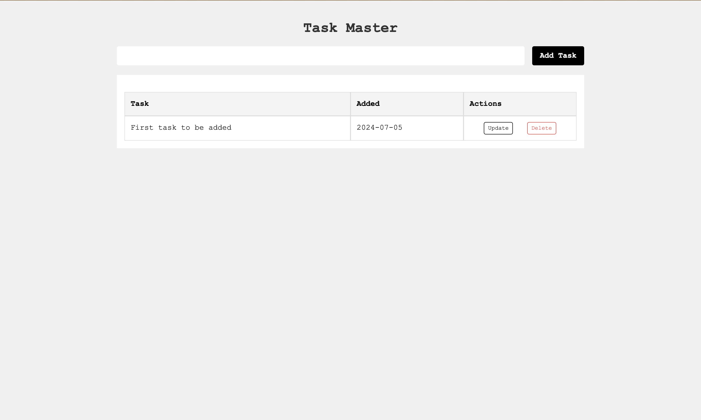
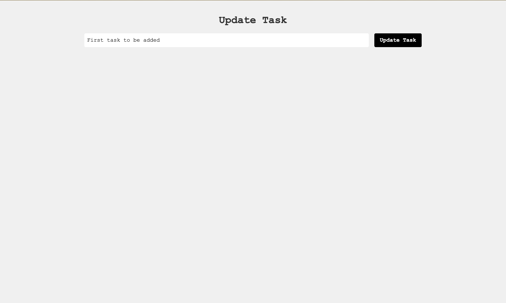
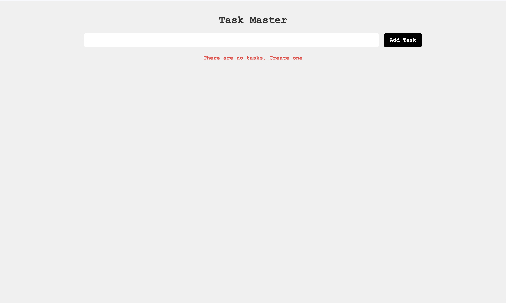

# Todo Master

## Overview

Todo Master is a simple and efficient task management application built using Flask. The app allows users to add, update, and delete tasks, making it easier to manage daily activities.

## Features

- **Add Tasks**: Easily add new tasks with a simple form.
- **Update Tasks**: Modify existing tasks to keep them up to date.
- **Delete Tasks**: Remove tasks that are no longer needed.
- **Responsive Design**: Accessible on both desktop and mobile devices.

## Screenshots

<div style="display: flex; justify-content: space-around;">
  
  
  
</div>

## Getting Started

Follow these instructions to get a copy of the project up and running on your local machine for development and testing purposes.

### Prerequisites

- Python 3.10.1
- Flask
- A virtual environment tool (e.g.`venv`)

### Installation

1. **Clone the repository:**

   ```sh
   git clone https://github.com/namanag0502/flask-todo.git
   cd todo-master
   ```

2. **Create and activate a virtual environment:**

   ```sh
   python3 -m venv venv
   source venv/bin/activate   # On Windows use `venv\Scripts\activate`
   ```

3. **Install the required packages:**

   ```sh
   pip install -r requirements.txt
   ```

4. **Run the application:**

   ```sh
   flask run
   ```

   The application will be available at `http://127.0.0.1:4000`.

### Folder Structure

```
todo-master/
├── static/
│   └── css/
│       └── main.css
├── templates/
│   ├── index.html
│   └── task_master.html
├── app.py
├── requirements.txt
└── README.md
```

### Main Files

- **app.py**: The main application file containing the Flask app and route definitions.
- **templates/index.html**: The base template file for the app.
- **templates/task_master.html**: The main page template for managing tasks.
- **static/css/main.css**: The CSS file for styling the application.

## Usage

### Adding a Task

1. Open the app in your browser.
2. Use the form to add a new task.
3. The task will appear in the task list.

### Updating a Task

1. Click on the "Update" link next to the task you want to update.
2. Modify the task details.
3. Save the changes.

### Deleting a Task

1. Click on the "Delete" link next to the task you want to remove.
2. Confirm the deletion.
3. The task will be removed from the list.

## Contributing

Contributions are welcome! Please fork this repository and submit pull requests with detailed explanations of your changes.

## License

This project is licensed under the MIT License - see the [LICENSE](LICENSE) file for details.

## Acknowledgements

- Thanks to the Flask community for their valuable resources and support.
- Icons made by [Freepik](https://www.flaticon.com/authors/freepik) from [Flaticon](https://www.flaticon.com/).
